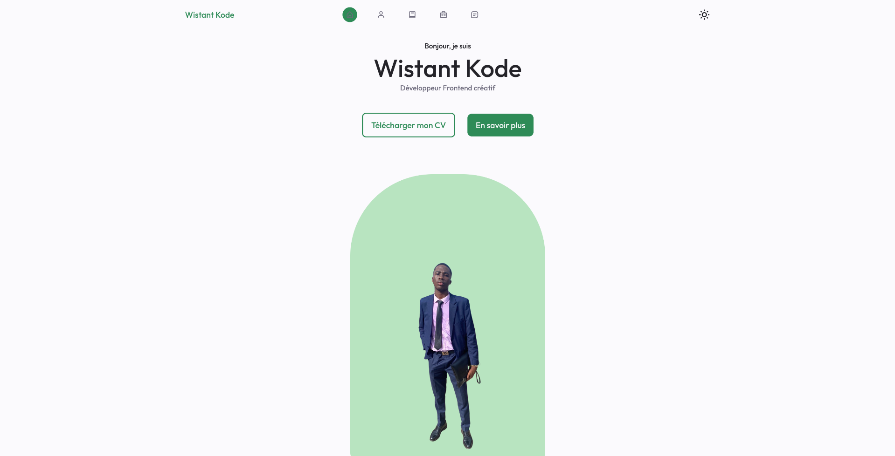

# ResponsivePortfolio


[](./src/about.png)
[](./src/contact_testimonial.png)

This project is a responsive portfolio designed to showcase my work as a creative frontend developer. It highlights my skills, projects, and services.

## Overview

The portfolio is built with a clean and modern user interface, featuring several key sections to present my profile and work effectively.


The portfolio also includes:

*   **Home:** A welcoming introduction with a profile picture, title, and call-to-action buttons.
*   **About:** A more detailed presentation of my experience and skills.
*   **Skills:** A list of my frontend and backend skills with proficiency levels.
*   **Testimonial:** A carousel to display client feedback.
*   **Footer:** Quick links to main sections and social media profiles.

## Technologies Used

*   **Frontend :**
    *   HTML5
    *   CSS3
    *   JavaScript (with DOM manipulation, events, etc.)
    *   CSS Libraries: Boxicons, Remixicon, Unicons, Swiper
*   **Backend :** (Mentioned in the Skills section, but not necessarily used in this frontend. To be clarified if a backend is used for the contact form or other features)
    *   PHP
    *   NodeJS
    *   Python
    *   MySQL
    *   Firebase
*   **Outils :**
    *   Git / GitHub (pour le contrôle de version)
    *   Swiper.js (pour le carrousel de témoignages)
    *   MixItUp (pour le filtrage des projets)

## File Structure

*   `index.html`: The main file containing the HTML structure of the portfolio.
*   `src/`: Folder containing the assets.
    *   `assets/`
        *   `css/`
            *   `style.css`: Main stylesheet. Defines the layout, colors, typography, etc.
            *   `swiper-bundle.min.css`: Styles for the Swiper library.
        *   `img/`: Folder for images (logo, profile picture, project screenshots, etc.).
        *   `js/`
            *   `main.js`: Main JavaScript file managing interactions, animations, etc.
            *   `swiper-bundle.min.js`: Swiper library.
            *   `mixitup.min.js`: MixItUp library.
        *   `pdf/`: Folder for PDF files (e.g., CV).

## Installation and Usage

1.  **Clone the repository:**
    ```bash
    git clone https://github.com/WistantKode/ResponsivePortfolio
    ```

2.  **Open `index.html` in a web browser:** You can simply open the `index.html` file with your browser.

3.  **(Optional) If you have a backend:** Follow the specific instructions to start the backend server (this will depend on the technologies used).

## Customization

*   **Content:** Modify the texts, images, and links in `index.html`.
*   **Styles:** Customize the appearance by modifying `src/assets/css/style.css`. You can add your own styles or change existing ones.
*   **Interactions:** Modify the scripts in `src/assets/js/main.js` to change animations, behaviors, etc.
*   **Add/Remove Sections:** You can modify the HTML structure to add new sections or remove those that are not needed.

## Possible Improvements

*   **Backend for the form:** Add a backend to handle contact form submissions (e.g., with NodeJS, PHP, etc.). Currently, the form does not send data.
*   **Accessibility:** Improve accessibility by adding `alt` attributes to images, using semantic HTML5 tags, checking color contrast, etc.
*   **Image Optimization:** Ensure all images are optimized for the web (reduced size, appropriate format) to improve loading times.
*   **CSS Preprocessor:** Use a CSS preprocessor like Sass or Less to better organize and maintain styles.
*   **Tests:** Add unit and integration tests to ensure code quality and robustness, especially if you add complex JavaScript features.
*   **JS Documentation:** Comment the JavaScript code in `main.js` to make it more understandable and maintainable.
*   **Error Handling:** Add error handling for AJAX requests (if used) and for user interactions (e.g., form validation).
*   **Deployment:** Add instructions for deploying the portfolio online (Netlify, Vercel, etc.).

## Author

Wistant Kode

## Licence
